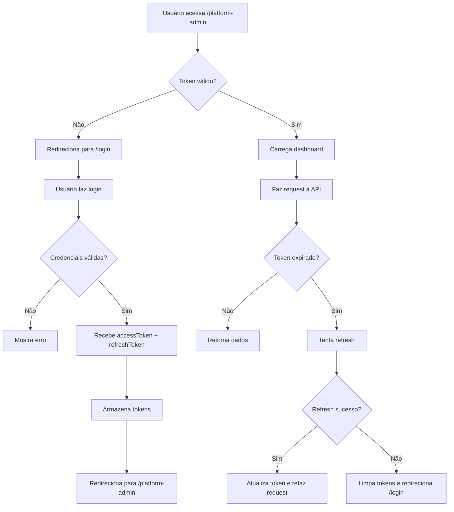

# 01 - Visão Geral e Estrutura do Projeto

[← Voltar ao Índice](./00-index.md) | [Próximo: Configuração Inicial →](./02-initial-configuration.md)

---

## 1. Visão Geral

Este documento detalha a visão geral do frontend da plataforma Healz, incluindo:

- **Reestruturação** da organização de pastas seguindo padrões de feature-based architecture
- **Configuração** de bibliotecas e ferramentas (Tanstack Router, Tanstack Query, Shadcn/UI)
- **Implementação** de autenticação completa (login, logout, refresh token, switch context)
- **Criação** do dashboard do painel administrativo da plataforma
- **Integração** completa com a API backend (http://localhost:3001/api/v1)

### 1.1. Stack Tecnológica

- **React 18** - Biblioteca UI
- **TypeScript 5** - Tipagem estática
- **Vite 6** - Build tool e dev server
- **Tanstack Router** - Roteamento file-based com type-safety
- **Tanstack Query v5** - State management assíncrono e cache
- **Tailwind CSS v4** - Estilização utilitária
- **Shadcn/UI** - Sistema de componentes
- **React Hook Form** - Gerenciamento de formulários
- **Zod** - Validação de schemas

### 1.2. Estado Atual

**Existente:**
- ✅ Configuração básica do Vite e TypeScript
- ✅ Tanstack Router e Query configurados
- ✅ ~60 componentes Shadcn/UI já instalados
- ✅ Fluxo de onboarding (páginas estáticas)
- ✅ Estrutura parcial de pastas

**A Implementar:**
- ❌ Estrutura de pastas completa seguindo feature-based architecture
- ❌ Configuração de axios com interceptors
- ❌ Sistema de autenticação (login, tokens, guards)
- ❌ Dashboard do painel admin
- ❌ Tipos TypeScript gerados a partir da API
- ❌ Queries e mutations para toda a API

---

## 2. Estrutura do Projeto

### 2.1. Arquitetura de Pastas

```
src/
├── components/              # Componentes reutilizáveis globais
│   ├── ui/                 # Componentes base do Shadcn/UI (60+ existentes)
│   └── layout/             # Componentes de layout (Header, Footer, etc)
│       ├── app-header.tsx
│       ├── app-footer.tsx
│       └── app-shell.tsx
│
├── features/               # Funcionalidades por domínio
│   ├── auth/              # Feature: Autenticação
│   │   ├── components/    # Componentes específicos de auth
│   │   │   ├── login-form.tsx
│   │   │   ├── forgot-password-form.tsx
│   │   │   └── reset-password-form.tsx
│   │   ├── hooks/         # Hooks específicos de auth
│   │   │   ├── use-auth.ts
│   │   │   └── use-session.ts
│   │   ├── api/           # Queries e mutations de auth
│   │   │   ├── queries.ts
│   │   │   └── mutations.ts
│   │   └── types.ts       # Types específicos de auth
│   │
│   ├── platform-admin/    # Feature: Painel Admin da Plataforma
│   │   ├── components/
│   │   │   ├── organizations/
│   │   │   │   ├── organizations-table.tsx
│   │   │   │   ├── organization-form.tsx
│   │   │   │   └── organization-details.tsx
│   │   │   ├── clinics/
│   │   │   │   ├── clinics-table.tsx
│   │   │   │   ├── clinic-form.tsx
│   │   │   │   └── clinic-details.tsx
│   │   │   ├── users/
│   │   │   │   ├── users-table.tsx
│   │   │   │   ├── user-form.tsx
│   │   │   │   └── user-details.tsx
│   │   │   └── dashboard/
│   │   │       ├── stats-cards.tsx
│   │   │       └── recent-activity.tsx
│   │   ├── hooks/
│   │   │   └── use-platform-admin.ts
│   │   ├── api/
│   │   │   ├── organizations-api.ts
│   │   │   ├── clinics-api.ts
│   │   │   └── users-api.ts
│   │   └── types.ts
│   │
│   ├── organizations/      # Feature: Gerenciamento de Organizações
│   │   ├── components/
│   │   ├── hooks/
│   │   ├── api/
│   │   └── types.ts
│   │
│   └── invites/           # Feature: Convites
│       ├── components/
│       ├── hooks/
│       ├── api/
│       └── types.ts
│
├── hooks/                  # Hooks compartilhados
│   ├── use-toast.ts       # ✅ Existente
│   ├── use-mobile.tsx     # ✅ Existente
│   ├── use-auth-guard.ts  # Guard para rotas autenticadas
│   ├── use-debounce.ts    # Debounce de valores
│   └── use-pagination.ts  # Lógica de paginação
│
├── lib/                    # Configurações de libs externas
│   ├── api/               # Configuração de APIs
│   │   ├── axios.ts       # Cliente axios com interceptors
│   │   ├── api-client.ts  # Wrapper da API
│   │   └── endpoints.ts   # Constantes de endpoints
│   ├── queryClient.ts     # ✅ Existente - Configuração Tanstack Query
│   ├── router.ts          # ✅ Existente - Configuração Tanstack Router
│   └── utils.ts           # Funções utilitárias
│
├── services/               # Serviços e APIs genéricos
│   ├── storage.service.ts # LocalStorage/SessionStorage
│   ├── auth.service.ts    # Serviço de autenticação
│   └── token.service.ts   # Gerenciamento de tokens
│
├── types/                  # Types globais
│   ├── api.types.ts       # Types da API
│   ├── auth.types.ts      # Types de autenticação
│   ├── common.types.ts    # Types comuns
│   └── index.ts           # Re-exports
│
├── utils/                  # Funções utilitárias
│   ├── format.ts          # Formatação (datas, números, etc)
│   ├── validation.ts      # Validações customizadas
│   └── cn.ts              # ✅ Existente - class-merge utility
│
├── routes/                 # Rotas do Tanstack Router
│   ├── __root.tsx         # ✅ Existente - Layout raiz
│   ├── index.tsx          # ✅ Existente - Home
│   │
│   ├── _public/           # Rotas públicas (sem autenticação)
│   │   ├── login.tsx
│   │   ├── forgot-password.tsx
│   │   ├── reset-password.tsx
│   │   ├── verify-email.tsx
│   │   ├── accept-invite.tsx
│   │   └── onboarding/    # ✅ Existente - Fluxo de onboarding
│   │
│   └── _authenticated/    # Rotas autenticadas (requer login)
│       ├── _layout.tsx    # Layout com sidebar e header
│       │
│       ├── platform-admin/         # Painel Admin da Plataforma
│       │   ├── index.tsx           # Dashboard overview
│       │   ├── organizations/
│       │   │   ├── index.tsx       # Lista de organizações
│       │   │   ├── $id.tsx         # Detalhes da organização
│       │   │   └── new.tsx         # Criar organização
│       │   ├── clinics/
│       │   │   ├── index.tsx       # Lista de clínicas
│       │   │   ├── $id.tsx         # Detalhes da clínica
│       │   │   └── new.tsx         # Criar clínica
│       │   └── users/
│       │       ├── index.tsx       # Lista de usuários
│       │       ├── $id.tsx         # Detalhes do usuário
│       │       └── new.tsx         # Criar usuário
│       │
│       └── settings/
│           └── profile.tsx
│
├── assets/                 # Assets estáticos
│   ├── images/
│   ├── icons/
│   └── fonts/
│
├── App.tsx                 # Componente raiz
├── main.tsx               # ✅ Existente - Entry point
└── index.css              # Estilos globais + Tailwind
```

### 2.2. Convenções de Nomenclatura

- **Arquivos de componentes:** `kebab-case.tsx` (ex: `login-form.tsx`)
- **Componentes React:** `PascalCase` (ex: `LoginForm`)
- **Hooks:** `use-kebab-case.ts` (ex: `use-auth.ts`)
- **Types/Interfaces:** `PascalCase` com sufixo quando necessário (ex: `User`, `LoginDto`)
- **Constantes:** `UPPER_SNAKE_CASE` (ex: `API_BASE_URL`)
- **Funções utilitárias:** `camelCase` (ex: `formatDate`)

---

## 3. Organização por Features

A arquitetura segue o padrão **feature-based**, onde cada funcionalidade (feature) contém todos os seus arquivos relacionados:

### Estrutura de uma Feature

```
features/
└── nome-da-feature/
    ├── components/      # Componentes específicos da feature
    ├── hooks/          # Hooks específicos da feature
    ├── api/            # Queries e mutations
    ├── types.ts        # Types específicos
    └── utils.ts        # Utilitários específicos (opcional)
```

### Vantagens desta Abordagem

1. **Coesão**: Código relacionado fica junto
2. **Escalabilidade**: Fácil adicionar/remover features
3. **Manutenibilidade**: Mudanças ficam isoladas
4. **Reutilização**: Componentes globais ficam separados
5. **Clareza**: Estrutura intuitiva e fácil navegação

---

## 4. Separação de Rotas

### Rotas Públicas (`_public/`)

Rotas acessíveis **sem autenticação**:
- `/login` - Tela de login
- `/forgot-password` - Recuperação de senha
- `/reset-password` - Redefinir senha
- `/verify-email` - Verificar email
- `/accept-invite` - Aceitar convite
- `/onboarding/*` - Fluxo de onboarding

### Rotas Autenticadas (`_authenticated/`)

Rotas que **requerem login**:
- `/platform-admin/*` - Painel administrativo da plataforma
- `/settings/*` - Configurações do usuário

**Mecanismo de Proteção:**
- Usa `beforeLoad` do Tanstack Router
- Verifica token com `tokenService.hasValidToken()`
- Redireciona para `/login` se não autenticado

---

## 5. Integração com a API

### Endpoint Base
```
http://localhost:3001/api/v1
```

### Autenticação
- **Access Token**: Armazenado em `localStorage`
- **Refresh Token**: Cookie httpOnly (gerenciado pelo backend)
- **Interceptor**: Adiciona token automaticamente em todas as requests
- **Refresh automático**: Renova token quando recebe 401

### Principais Módulos da API

1. **Auth** - `/auth/*`
   - Login, logout, refresh, switch context
   - Verificação de email, recuperação de senha

2. **Platform Admin** - `/platform-admin/*`
   - Organizations, clinics, users
   - Ações administrativas da plataforma

3. **Invites** - `/invites/*`
   - Envio e aceitação de convites

---

## 6. Estado Global e Cache

### Tanstack Query

Gerencia todo o estado assíncrono da aplicação:

- **Queries**: Busca de dados (GET)
- **Mutations**: Modificação de dados (POST/PUT/PATCH/DELETE)
- **Cache**: Dados ficam em cache com estratégias configuráveis
- **Invalidation**: Atualização automática após mutations

### Query Keys Hierárquicas

```typescript
// Auth
['auth', 'user']

// Platform Admin - Organizations
['platform-admin', 'organizations']
['platform-admin', 'organizations', params]
['platform-admin', 'organizations', id]

// Platform Admin - Clinics
['platform-admin', 'clinics']
['platform-admin', 'clinics', params]
['platform-admin', 'clinics', id]

// Platform Admin - Users
['platform-admin', 'users']
['platform-admin', 'users', params]
['platform-admin', 'users', id]
```

Esta hierarquia permite invalidações precisas e granulares.

---

## 7. Fluxo de Autenticação



---

## 8. Próximos Passos

1. Leia [02 - Configuração Inicial](./02-initial-configuration.md) para configurar axios, tokens e types
2. Configure os componentes em [03 - Componentes Shadcn/UI](./03-shadcn-components.md)
3. Implemente as queries conforme documentos 04 e 05
4. Construa as telas seguindo documentos 06 e 07

---

[← Voltar ao Índice](./00-index.md) | [Próximo: Configuração Inicial →](./02-initial-configuration.md)
